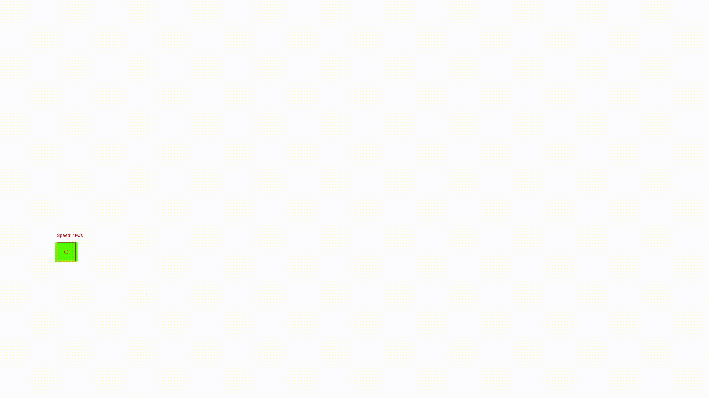

# Point Tracker

This is a simple implementation of a high contrast point tracker built from scratch using Java and JavaFX. 

## Table of contents

- [Introduction](#introduction)
- [Features](#features)
- [Usage](#usage)
- [Examples](#examples)

## Introduction

It is a GUI based program that takes in an input video, tracks a particular point to output details about the point's speed, direction, deviation, etc from a fixed path. The output analytics is overlayed on top of the original input video and is saved to a directory of the user's choice.

## Features
- Take video input in numerous video formats and codecs
- Track a particlar color of user's choice
- Track the high contrast point using an iterative prediction algorithm that minimizes the number of pixels searched for the color by predicting the points motion
- Scale the output speed calculations by selecting pixels highlighting 1 track width in the program
- Save output to any directory

## Usage

1. Run program and click the `load` button
2. Select a sample input video with a high contrast point
3. Click the `track` button and click on the high contrast point to set the tracking color
4. Click the `scale` button
5. Click on either end of 1 Track Width (tw) to set the scale
6. Click process and choose a directory to save output video to ( Progress and iterations/20 per frame in the console )

## Examples
1. 
   
